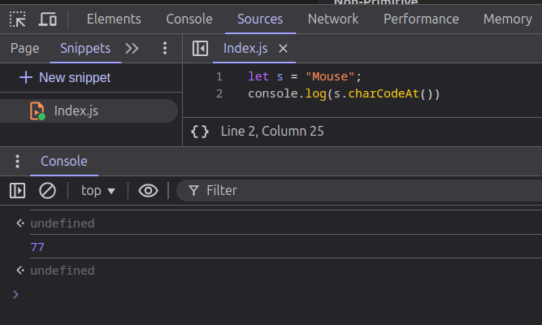

## OOPS in JavaScript:

**OOPS**:(Object Oriented Programming System) oops is methodology to design a program using classes and objects.
it simplifies software development and maintenance by providing some concepts:

1. object
2. class
3. inheritance
4. polymorphism
5. abstraction
6. encapsulation

### 1.Object:

- Any entity that has state and behavior is known as an object.
- For example, a chair, pen, table, keyboard, bike, etc. It can be physical or logical.
- An Object can be defined as an instance of a class.

#### Example:

```javascript []
var name = { name: "Praveen" }; //creation of an object
```

But, to create multiple objects of the same type, the object literal method is inefficient but we have a solution.

### Constructor functions:

- Constructors are functions designed to create new objects
- We can create objects in Js using functions as well.
- This is one example of creating an object using a function.

```javascript []
function Player(name, team) { //constructor function
this.name=name
this.team=team
}
var myObj = new Player("Virat Kohli","RCB");

//Above code is similar to this


Let myObj = {}

function Player(name, team) {
myObj.name=name
myObj.team=team

Return myObj
}

var myObj = new Player("Virat Kohli","RCB");


//Notice, how ‘this’ is replaced by myObj
```

```javascript []
let dog = new Animal();
```

### 'This' Keyword in Action:

- Inside the constructor this keyword refers to the new object being created.
- we can add properties and methods to this new object using _this_.
- These properties are then assigned to each instance of the object created using the constructor.

```javascript []
function Person(name, age) {
  this.name = name;
  this.age = age;

  this.describe = function () {
    return `${this.name} is ${this.age} years old.`;
  };
}

const person1 = new Person("Mohi", 25);
console.log(person1.describe()); // Outputs: "Mohi is 25 years old."
```

### 2.Class:

- A class is a collection of objects. It is a logical entity.
- A class can also be defined as a blueprint from which you can create an individual object.
- A class contains fields and methods to describe the behavior of an object and to manipulate data.

#### Example:

```javascript []
class Animal {
  constructor(name, sound) {
    this.name = name;
    this.sound = sound;
  }
  makesound() {
    return `${this.name} make ${this.sound} sound`;
  }
}
let dog = new Animal("dog", "bow"); // creation of an object
console.log(dog.makesound());
let cat = new Animal("cat", "meow"); // creation of an object, we can create multiple objects for the single instance of a class.
console.log(cat.makesound());
```

### 3.Inheritance:

---//----------------------------------------------------------------------------------------

### Copy by value and copy by reference:

#### Copy by value:

- In the JavaScript when we are try to copy the primitive values i.e Number,String,Boolean,Undefined,Null,BigInt these values get deep copied.
- that means that when we deep copied a value and try to change it's value it won't effect the original value.
- In the primitive types we can easily copy the value by the equal (=) sign.
  **Example**

```javascript []
let x = 10;
let y = x;
y += 10;
console.log(x); //10
console.log(y); //20
```

- in the example we copied the variable x value into y and modified it's value but i doesn't effected the original value.

### copy by reference:

- In the JavaScript when we try to copy the values on reference type or non-primitive type values it's copied only the address or reference that is called shallow copy.
- for deep copying the reference values we need to use Js methods like JSON,spread operator or lodash method.
- if we use spread operator it only deep copies the value by the one level and remaining level's will be copied by reference.
- if we need to deep copy to the nested levels as well then we need to use the JSON methods or Lodash method.
  **Example with spread operator**

```javascript []
let val = [10, 20, 30];
let CopyVal = [...val];
CopyVal[0] = 100;
console.log(val); //[10,20,30]
console.log(CopyVal); // [100,20,30]
```

- In the above example val variable is deep copied into the CopyVal and when we tried to modify it does not effected the original value because we used spread operator and value is single level only.

```javascript []
let val = [10, 20, [30, 40]];
let CopyVal = [...val];
CopyVal[2][0] = 100;
console.log(val); // [10,20,[100,40]]
console.log(CopyVal); //[10,20,[100,40]]
```

- in the above example also we copied value into anther variable try to modify but it also effected the original value because it has nested values.
- Spread operator only deep copy into single level.

  **Example with JSON**

```javascript []
let val = [10, 20, 30, [40, 50, [60, 70], 80], 90];
let copyVal = JSON.parse(JSON.stringify(val));
copyVal[3][1] = 300;
console.log(val); //[10,20,30,[40,50,[60,70],80],90]
console.log(copyVal); //[10,20,30,[40,300,[60,70],80],90]
```

- in the above we created a array and deep copied using JSON methods and tried to modify values so in the example even we modified the nested value it doesn't effected the original value.

**Example with lodash**

```javascript []
let lodash = require("lodash");
let val = [1, 2, 3, [4, 5, [6, 7], 8], 9];
let newVal = lodash.cloneDeep(val);
newVal[2][2][0] = 200;
console.log(val); //[1,2,3,[4,5,[6,7],8],9]
console.log(newVal); //[1,2,3,[4,5,[200,7],8],9]
```

- in the above as well value is deep copied.

### Pass by value and Pass by reference:

#### Pass by value:

- Pass by Value means that when you pass a variable to a function, JavaScript creates a copy of the variable’s value and uses it inside the function.
- This means any changes made to the variable inside the function do not affect the original variable outside the function.
  **Example**

```javascript []
let a = 21;
let b = 31;
function PassByValue(a, b) {
  a += b;
  b += a;
  console.log(a, b); //52, 83
}
PassByValue(a, b);
console.log(a, b); //21,31
```

- in the example we passed the value a,b inside a function and modified it but it doesn't effected outside value is called pass by value.

#### Pass By Reference:

- Pass by Reference means that when you pass a variable (specifically, objects or arrays) to a function, JavaScript passes the reference or memory address of the variable, not a copy.
- This means any changes made to the variable inside the function will affect the original variable outside the function.
  **Example**

```javascript []
let a = [1, 2, 4, 5];
function PassByReference(a) {
  for (let i = 0; i < a.length; i++) {
    a[i] = a[i] * i;
  }
  console.log(a); //[0, 2, 8, 15]
}
PassByReference(a);
console.log(a); //[0, 2, 8, 15]
```

- in the example we passed the value i.e array to inside a function and modified the array values so it's also effected the original value is called pass by reference.

### Shallow Copy Vs Deep Copy:

#### Deep Copy:

- The value of the original variable is copied into new variable and there will not be any relation between new variable and original values.
- If we change we change the new value the original value is unchanged.

#### Shallow Copy:

- In the Shallow copy only reference of a original variable is copied.
- so if we change the new variable will effects the original value.
- in the JavaScript, when we copy the values, the primitive are get deep copied.
- Non-primitive values are only copy the reference they only get shallow copied.

### What is JSON?

- it stands for JavaScript Object Notation.
- JSON syntax is derived from the JavaScript Object,but the JSON formate is text only.
- meaning the JSON object is quite literally just a string.

**Example**

```javascript []
let obj = { fname: "Rakesh", lname: "Reddy", Age: 21 };
let jsonObj = JOSN.stringify(obj);
console.log(obj); //{fname:"Rakesh",lname:"Reddy",Age:21}
console.log(jsonObj); //{"fname":"Rakesh","lname":"Reddy","Age":21}  JSON object just like a string
```

#### When do we use a JSON object?

- JSON data is light weight.
- JSON data is used to read the data from the server and display it on the webpage
- JSON data is mainly is used to exchange the data between the server and browser. JSON data is light weight so the data processing is faster.
- When we exchange data between a browser and a server it can only be text, hence we can use JSON for this.

#### Methods to convert JSON.

**Sending Data**
_JSON.stringify()_ will converts the JavaScript object into the JSON object that can send to the web browser.

```javascript []
let obj = { fname: "Praveen", lname: "Reddy", Age: 24 };
console.log(JSON.stringify(obj)); //{"fname":"Praveen","lname":"Reddy","Age":24}
```

**Receiving Data**
_JSON.parse()_ will converts the text into the JavaScript Object.

```javascript []
let JsonObj = { fname: "Praveen", lname: "Reddy", Age: 24 };
console.log(JSON.parse(JsonObj)); //{ fname: "Praveen", lname: "Reddy", Age: 24 }
```

### JavaScript object vs. JSON object syntax

- A Javascript object has a similar syntax to JSON, it uses curly braces and key/value pairs.

```javascript []
//JavaScript Object
let obj = { fname: "Praveen", lname: "Reddy", Age: 24 };
//JSON Object
let JsonObj = { fname: "Praveen", lname: "Reddy", Age: 24 };
```

- The main difference in syntax is that in a JSON object the keys must be a string written with double quotes.

### JSON Data Types:

When sending our JSON text it must have a valid JSON data type, those include:

- String
- Number
- Object
- Boolean
- Array
- Null

**JSON values can't be:**

- A Function
- A Date
- Undefined

### Higher Order Functions:

- Higher order functions are functions that take one or more functions as arguments, or return a function as their result.
- This functions are also called as first class citizen in JavaScript (Ability to treat functions as values)

```javascript []
// Callback function, passed as a parameter in the higher order function
function callbackFunction() {
  console.log("I am a callback function");
}
//Higher Order function
function HigherOrderFunction(func) {
  console.log("I am a Higher Order Function");
  func();
}
HigherOrderFunction(callbackFunction);
```

In the above example 'HigherOrderFunction' is a HOF function because it accepts the function as a value.
**Advantages**

1. re-usability
2. simplicity
3. Easy to understand
4. Extendability

#### What is a callback function?

- A callback function is a function that can be as an argument to the another function.
  
- JavaScript runs code sequentially in top-down order. However, there are some cases that code runs (or must run) after something else happens and also not sequentially. This is called asynchronous programming.
- Callbacks make sure that a function is not going to run before a task is completed but will run right after the task has completed. It helps us develop asynchronous JavaScript code and keeps us safe from problems and errors.
- In JavaScript, the way to create a callback function is to pass it as a parameter to another function, and then to call it back right after something has happened or some task is completed.
  **Example**

```javascript []
function cb() {
  console.log("I am a callback Function");
}
function HigherOrderFunction(cb) {
  console.log("I am a Higher Order Function");
  cb();
}
```

### Array Methods(Operations):

**1. map():**

- creates a new array from calling a function for every array elements.
- does not execute for empty elements.
- does not change the original array.

**syntax**

```javascript []
array.map(function(currentValue, index, arr), thisValue)
```

**Example**

```javascript []
let arr = [1, 2, 3, 4, 5, 6];
let newArr = arr.map((val, idx) => {
  return val * 2;
});
console.log(newArr); //[2, 4, 6, 8, 10, 12]
console.log(arr); //[1, 2, 3, 4, 5, 6]
```

**2. forEach():**

- method calls a function for each element in an array.
- does not execute for empty elements.
- does not return anything.
- does not change original array

**syntax**

```javascript []
array.forEach(function(currentValue, index, arr), thisValue)
```

**Example**

```javascript []
let sum = 0;
let numbers = [1, 2, 3, 4, 5];
numbers.forEach((val, idx) => {
  sum += val;
});
```

**3. filter():**

- method creates a new array filled with elements that pass a test provided by a function.
- does not execute for the empty elements.
- does not change the original array.

**syntax**

```javascript []
array.filter(function(currentValue, index, arr), thisValue)
```

**Example**

```javascript []
let arr = [1, 2, 3, 4, 5, 6, 7, 8];
let newArr = arr.filter((val, idx) => {
  return val % 2 === 0;
});
console.log(newArr); //[2,4,6,8]
```

**4. find():**

- It returns a value of first element that passes a test condition.
- it returns 'undefined' if no element passes the test condition.
- it does not execute for the empty elements.
- it does not change the original array.

**syntax**

```javascript []
array.find(function(currentValue, index, arr),thisValue)
```

**Example**

```javascript []
let val = [9, 7, 5, 2, 5, 8];
let firstVal = val.find((val, idx) => val % 2 === 0);
console.log(firstVal); // 2
```

**5. reduce():**

- reduce method is used when we want reduce the array into a single value.
- if we does not pass the intialvalue the _array[0]_ value is taken as the intialvalue.
- does not change the original array.
- does not execute for empty elements.

**syntax**

```javascript []
array.reduce(function(total, currentValue, currentIndex, arr), initialValue)
```

**Example**

```javascript []
let arr = [2, 5, 8, 1, 7, 8, 9];
let sum = arr.reduce((total, currVal) => {
  return total + currVal;
}, 0);
console.log(sum); //40
```

**6. every():**

- it executes a function for every element of the array.
- it returns 'true' if every element of an array passes the test condition,if not returns 'false'.
- does not execute for the empty elements.
- does not change the original array.

**syntax**

```javascript []
array.every(function(currentValue, index, arr), thisValue)


```

**Example:**

```javascript []
let arr = [1, 2, 3, 4, 5];
let newVal = arr.every((val, idx) => {
  return val % 2 === 0;
});
console.log(newVal); //false
```

**7. some():**

- it executes a function for every element of the array.
- it returns 'true' if any element of an array passes the test condition,if not returns 'false'.
- does not execute for the empty elements.
- does not change the original array.

**syntax**

```javascript []
array.some(function(value, index, arr), this)
```

**Example:**

```javascript []
let arr = [1, 2, 3, 4, 5, 6];
let val = arr.some((val, idx) => {
  return val % 2 === 0;
});
console.log(val); //true
```

**8.splice():**

- it returns selected elements in an array, as a new array.
- it selects from a given start, up to a (not inclusive) given end.
- does not change the original array.
- splice method does not work for the negative elements.
- slice method is also same as splice but slice method works for negative elements.

**syntax**

```javascript []
array.slice(start, end); // end not inclusive
```

**Example:**

```javascript []
//Example 1:
let arr = [12, 13, 15, 67, 89, 09];
let newArr = arr.splice(0, 3);
console.log(newArr); //[12,13,15]
//Example 2:
let result = arr.splice(4);
console.log(result); // [89,9]
//Example 3:
result = arr.splice(-4);
console.log(result); //[15, 67, 89, 9]
result = arr.splice(0, -4);
console.log(result); // []
```

**Example for slice method:**

````javascript []
let arr = [1,2,3,4,5,6,7];
let result = arr.slice(0,-2);
console.log(result) //[1,2,3,4,5]  -> -2 means it removes the 2 elements fom the end
// same example for splice
let result2 = arr.splice(0,-2)
console.log(result2) //[] -> it give empty array because it does not execute for negative values
```

**9. shift():**

- removes a element in the beginning of an array.
- changes the length of the array.
- returns a removed value.

**syntax**

```javascript []
array.shift();
````

**Example:**

```javascript []
let arr = [1, 2, 3, 4];
arr.shift();
console.log(arr); //[2,3,4]
```

**10. flat():**

- it concatenates sub-array elements.
- it is used to flatten the array.
- if you does not mentioned the depth then it will taken as depth is '1'.

**syntax**

```javascript []
array.flat(depth);
```

**Example:**

```javascript []
const myArr = [1, 2, [3, [4, 5, 6], 7], 8];
const newArr = myArr.flat(2);
console.log(newArr); //[1, 2, 3, 4, 5, 6, 7, 8]
//Example 2:

const myArr = [1, 2, [3, [4, 5, 6], 7], 8];
const newArr = myArr.flat();
console.log(newArr); //[1, 2, 3, [4, 5, 6], 7, 8]
```

**11. reverse():**

- reverse the order of the elements in the array.
- make the change in the original array.

**syntax**

```javascript []
array.reverse();
```

**Example:**

```javascript []
let names = ["Rakesh", "Praveen", "Chandu"];
names.reverse();
console.log(names); //["chandu","Praveen","Rakesh"]
```

**12. includes:**

- it returns true if an array contains a specified value.
- it returns false if the value is not found.
- it is case sensitive.

**syntax**

```javascript []
array.includes(element, start);
```

**Example:**

```javascript []
let arr = [1, 2, 3, 4, 5];
arr.includes(2); //true
```

**13. unshift():**

- Add the element in the beginning
- change the length of the array.

**syntax**

```javascript []
array.unshift();
```

**Example:**

```javascript []
let arr = [1, 2, 3, 4];
arr.unshift(0);
console.log(arr); //[0,1,2,3,4]
```

**14. push():**

- Add the element in the end of an array
- change the length of the array.

**syntax**

```javascript []
array.push();
```

**Example:**

```javascript []
let arr = [1, 2, 3, 4];
arr.push(5);
console.log(arr); //[1,2,3,4,5]
```

**15. pop():**

- removes a element in the end of an array.
- changes the length of the array.
- returns a removed value.

**syntax**

```javascript []
array.pop();
```

**Example:**

```javascript []
let arr = [1, 2, 3, 4];
arr.pop();
console.log(arr); //[1,2,3]
```

**16. entries():**

- it return a new array iterator object that contains key/value pair for each index of element in the array.
- _Return Value:_ iterator object.
- does not work for the empty elements gives undefined.

```javascript []
let arr = [1, 2, 3, 4, 5, 6];
let newArr = arr.entries();
console.log(newArr); // Array Iterator {}
console.log(newArr.next()); //{value: Array(2), done: false}
console.log(newArr.next().value); // [0,1] [index,value]
```

### String Methods(Operations):

**1. toUpperCase():**

- converts to the lowercase to uppercase

**Example:**

```javascript []
let name = "Rakesh";
console.log(name.toUpperCase()); //"RAKESH"
```

**2. toLowerCase():**

- converts to the uppercase to lowercase

**Example**

```javascript []
let name = "RAKESH";
console.log(name.toLowerCase()); //"rakesh
```

**3. trim():**

- it removes whitespace from both sides of a string:

**Example:**

```javascript []
let text1 = "      Hello World!      ";
let text2 = text1.trim();
console.log(text2); //"Hello World!"
```

**4. trimStart():**

- it removes white spaces only from the start of a string.

**Example:**

```javascript []
let text1 = "     Hello World!     ";
let text2 = text1.trimStart();
console.log(text2); //"Hello World!     "
```

**5. trimEnd():**

- it removes white spaces only at the end of a string.

**Example**

```javascript []
let text1 = "     Hello World!     ";
let text2 = text1.trimStart();
console.log(text2); //"     Hello World!"
```

**6. concat():**

- used to join two/more strings.
  **syntax**

```javascript []
array.concat(arr1,arr2,arr3....)
string.concat(str1,str2,str3....)
```

**Example:**

```javascript []
let s1 = "Rakesh";
let s2 = "Reddy";
let s3 = s1.concat(" ", s2); // two string concatenation
console.log(s3); // "Rakesh Reddy"
let arr = [1, 2, 3, 4, 5, 6];
let arr2 = [7, 8, 9];
let arr3 = [10, 11, 12, 13];
let arr4 = arr.concat(arr2, arr3);
console.log(arr4); // [1, 2, 3, 4, 5, 6, 7, 8, 9, 10, 11, 12, 13]
```

**7. endsWith():**

- it determines whether a string ends with the characters of this string, returning true or false as appropriate.
  **Example:**

```javascript []
const str1 = "Cats are the best!";

console.log(str1.endsWith("best!"));
//output: true

console.log(str1.endsWith("best", 17));
//output: true

const str2 = "Is this a question?";

console.log(str2.endsWith("question"));
//output: false
```

**8. includes:**

- it returns true if an string contains a specified value.
- it returns false if the value is not found.
- it is case sensitive.

**syntax**

```javascript []
string.includes(element, start);
```

**Example:**

```javascript []
let str = "Game Changer";
str.includes("Game"); //true
```

**9. indexOf():**

- returns index of a character.
- if no element pass test condition then it return '-1'

**Example:**

```javascript []
var string1 = "Hello World!";
console.log(string1.indexOf("e")); //1
```

**10. lastIndexOf():**

- returns the index of the last occurrence of a specified character.
- if no element pass test condition then it return '-1'

**Example:**

```javascript []
var string = "Hello World,Say Hello, Don't say Hello";
console.log(string.lastIndexOf("H")); // 33
```

**11. padEnd():**

- The padEnd() method pads a string from the end.
- It pads a string with another string (multiple times) until it reaches a given length.
- return a new string.
- does not modify the original string

**syntax**

```javascript []
string1.padEnd(length, string);
```

**Example:**

```javascript []
let val = "5";
let newVal = val.padEnd(4, "0");
console.log(newVal); //5000
```

**11. padStart():**

- The padEnd() method pads a string from the start.
- It pads a string with another string (multiple times) until it reaches a given length.
- return a new string.
- does not modify the original string

**syntax**

```javascript []
string1.padStart(length, string);
```

**Example:**

```javascript []
let val = "5";
let newVal = val.padStart(4, "1");
console.log(newVal); //1115
```

**12. repeat():**

- it returns a string with number of copies of a string.
- returns a new string
- it does not change the original string.

```javascript []
let text = "Hello world!";
let result = text.repeat(2); //"Hello world! Hello world!"
```

**13. replace():**

- it replace a value with the another value in the string.
- changes only the first match.
- does not change the original string.
- returns a new a string.

**Example:**

```javascript []
let text = "Hello this Rakesh";
let text2 = text.replace("Rakesh", "Praveen");
console.log(text2); //"Hello this Praveen"
```

**14. slice():**

- slice method extracts a part of a string.
- it returns a new string with the extracted part of a original string.
- does not change the original string.

**Example:**

```javascript []
let val = "Hello World!";
let newVal = val.slice(0, 4); // end is not inclusive
console.log(newVal); //Hell
```

**15. split():**

- used to split a string into array of strings.
- returns a new string.
- does not make change in the original string.

**Example:**

```javascript []
let string = "AMAZON";
let arr = string.split("");
console.log(arr); //["A","M","A","Z","O","N"]
```

**16. substring():**

- it returns a part of a string.
- does not change the original string.

**Example:**

```javascript []
let s = "Hello World!";
let newS = s.substring(0, 4); // end is not inclusive
console.log(newS); //"Hell
```

**17. charAt():**

- returns a character at a specified position/index
- if we don't mention any position then it will default value will take that is 0 index.
- if we give negative index it will give 'undefined'.
  
  **Example:**

```javascript []
let string = "Hello World!";
console.log(string.charAt(7)); // "W"
```

**18. charCodeAt():**

- returns a unicode / ASCII value at a specified index
- if we don't mention any position then it will default value will take that is 0 index.
- if we give negative index it will give 'undefined'.
  

**Example:**

```javascript []
let string = "Praveen";
console.log(string.charCodeAt(3)); //97
```

**19. fromCharCode():**

- returns a character of a specified ASCII value.
  **Example:**

```javascript []
console.log(String.fromCharCode(121)); // y
```

**20. length**

- return a length of a string/array

```javascript []
let arr = [1, 2, 3, 4];
let string = "Game Changer";
console.log(arr.length); //4
console.log(string.length); //12
```

### Object Methods:

**01. assign():**

- copies the properties from the source(one or more) object to the target object.

**syntax**

```javascript []
Object.assign(target, source);
```

**Example:**

```javascript []
let person1 = {
  firstName: "Bandi",
  lastName: "Rakesh",
  age: 21,
};
let person2 = {
  firstName: "Bandi",
  lastName: "Praveen",
};
Object.assign(person1, person2);
console.log(person1); // {firstName: 'Bandi', lastName: 'Praveen', age: 21}
```

**02. create():**

- The Object.create() static method creates a new object, using an existing object as the prototype of the newly created object.

```javascript []
// Create an Object:
const person = {
  firstName: "John",
  lastName: "Doe",
};

// Create new Object
const man = Object.create(person);
console.log(man); // {}
console.log(man.firstName); // John
```

**03. entries():**

- returns an array of key/value pair of an object

```javascript []
const person = {
  firstName: "John",
  lastName: "Doe",
  age: 50,
  eyeColor: "blue",
};

let text = Object.entries(person);
```

**04. fromEntries():**

- create an object with list of array of key/value pair

```javascript []
const fruits = [
  ["apples", 300],
  ["pears", 900],
  ["bananas", 500],
];

const myObj = Object.fromEntries(fruits);
/** {apples:300,
  pears:900,
  bananas:500}
*/
```

**05. keys():**

- return an array of the key value of an object.

```javascript []
let obj = {
  name: "Game Changer",
  releaseData: "10/01/2025",
  Hero: "Ramcharan",
  Director: "Shankar",
};
let keys = Object.keys(obj);
console.log(keys); //['name', 'releaseData', 'Hero', 'Director']
```

**06. values():**

- returns an array of values of an object.

```javascript []
let obj = {
  name: "Game Changer",
  releaseData: "10/01/2025",
  Hero: "Ramcharan",
  Director: "Shankar",
};
let keys = Object.values(obj);
console.log(keys); //['Game Changer', '10/01/2025', 'Ramcharan', 'Shankar']
```

### What is Scope?

- Scope refers to the context or environment in which variables are declared and accessed.
- It determines where a particular variable is valid and accessible within your code. so the variables accessible within their scope.
- In js we have multiple scopes.

**1. Global Scope:**

- Variables declared outside any function become global. They are accessible from anywhere in your JavaScript program.
- Example:

```javascript []
var carName = "Volvo"; // Global scope
function myFunction() {
  // carName is accessible in the function as well
}
```

**2.Function Scope:**

- Variables declared within a function are local to that function. They are only accessible within the function.
- Functions create their own scope.
- Example:

```javascript []
function myFunction() {
  let carName = "Volvo"; // Function scope
  // carName only accessible inside this function.
}
```

**3.Block Scope:**

- Variables declared with let and const have block scope.
- Block scope is confined to a pair of curly braces { }
- Variables declared inside a block (within { }) cannot be accessed from outside the block.
- Example:

```javascript []
{
  let x = 2; // Block scope
}
// x cannot be used here
```

### Hoisting:

- Hoisting is a JavaScript mechanism or behavior where variables and function declarations are moved to the top of their scope before code execution.
- Hoisting is not just for variable declarations. It also affects function declarations.
- In the Execution Context it has two phases, Memory phase and Code Phase, In the Memory Phase all variables are initialized with special keyword "Undefined" and Functions are stored as it is.(Note: Arrow Functions are initialized with Undefined)
- So, Before code Executed in th code Execution phase , all variables and functions are initialized with special keyword "Undefined" and functions are stored as it is.
- So, we can able access the variable and functions before there declarations. is called as Hoisting.
- Variable are not Hoisted,Function declarations are Hoisted
- Example:

```javascript []
console.log(a); //==> Output: Undefined
console.log(getName()); //==> Output: Rakesh
console.log(getName); //==> Output: function getName(){console.log("Rakesh");}
var a = 10;
function getName() {
  console.log("Rakesh");
}
```

### Closure:

- Function bundled with its lexical environment is known as a closure. Whenever a function is returned,
- even if its vanished in execution context but still it remembers the reference it was pointing to.
- Its not just that function alone it returns but the entire closure
  or
- A closure is the combination of a function bundled together (enclosed) with references to its surrounding state (the lexical environment). In other words, a closure gives you access to an outer function's scope from an inner function.
- In JavaScript, closures are created every time a function is created, at function creation time.
- Example:

```javascript []
function x() {
  let a = 12;
  function y() {
    console.log(a);
  }
}
```

- In the Example inner function have the access to the outer function scope or parent scope. so,it's bundled with it's parent scope

```javascript []
function b(){
  let x=11;
  return function a(){
      console.log(x)
  }
}
let z=b();
z() => Output==> 11
```

- so,if we return a function even it's still Remember where it from so,it can remember it's parent scope and we can access
- it in outside by returning it from a function.

## Asynchronous JavaScript:

#### 1.Callback Function:

- callback function is a functions that can be passed an argument to the another function or function takes another function as a parameter is called callback function.
  

**Example**

```javascript []
let cb = () => {
  console.log("After 2 seconds"); //callback function
};
setTimeout(cb, 2000);
```

### Types of Functions in JavaScript.

- In JavaScript, there are several types of functions that serve different purposes and are used in various contexts. Here are the main types:

#### Named Functions:

- These are the functions that have a name and can be called by referencing that name.
- They are defined using the function keyword followed by the name of the function and it's parameters.

```javascript []
function helloWorld() {
  console.log("Hello World!");
}
helloWorld(); // Outputs 'Hello World!'
```

#### Anonymous Functions:

- Anonymous Function means a function without a name is called an Anonymous Function.

**Example**

```javascript []
//normal js declarations
function() {
  // Function Body
}
//ES6 declarations -> Arrow Functions
() => {
  // Function Body
}
(function (){
  console.log("i am an Anonymous Function (:" )
}())
```

#### Arrow Functions:

- arrow functions are introduced in the in the ES6 and it is a shorter syntax functions.
- it makes to define the function in simple and easy way.

```javascript []
const square = (num) => num * num;
console.log(square(5)); // Outputs 25
```

#### Constructor Function:

- These functions are used to create the objects.
- They are typically used with new keyword and function name start with the capital letter.
- constructor functions initialize the properties and methods of an object they create.

```javascript []
function Person(name) {
  this.name = name;
}
const john = new Person("Alex");
console.log(john.name); // Outputs 'Alex'
```

#### IIFE (Immediately Invoked Function Expression):

- These are the functions that are immediately invoked after they defined.
- These are often used to encapsulate code avoid polluting the global name space.
- function should wrapped inside the `()`

```javascript []
(function () {
  console.log("This function is immediately invoked");
})();
```

#### Async Functions:

- These functions are start with `async` keyword and allows us to write the asynchronous code in a more readable way using the `await` keyword.
- They are particularly useful for handling the asynchronous operations like network operations or fetching the data from the api.
- Async function always return a `Promise`

```javascript []
async function fetchData() {
  let data = await fetch("https://api.example.com/data");
  return data.json();
}
fetchData.then((data) => console.log(data));
```

#### Generator Functions:

- These functions use the `function*` syntax and `yield` keyword to generate the sequence of values.
- They can be paused and resumed, making them useful for operations that need to be broken down into smaller, manageable parts.

```javascript []
function* generator(i) {
  yield i;
  yield i + 10;
}
const gen = generator(5);
console.log(gen.next().value); // Outputs 5
console.log(gen.next().value); // Outputs 15
```

```javascript []
function* generateIds() {
  let id = 1;
  while (true) {
    yield id;
    id += 1;
  }
}
let id = generateIds();
console.log(id.next()); //{value: 1, done: false}
console.log(id.next()); //{value: 2, done: false}
for (let i = 0; i < 100; i++) {
  console.log(id.next());
} // it will always generate an increasing number and that is unique
```

### Callback Hell:

- callback hell is a situation when we nested the asynchronous call backs or synchronous (that performs async operations inside the function). it will leads to call back hell. it is also know as pyramid of doom.
  
- Two problems with callbacks are:

1. Callback Hell - It happens due to calling callbacks inside an another callback and so on. Also known as pyramid of doom. This makes code look ugly and unmaintainable in real world programming. Here the code grows horizontally.

2. Inversion of Control - When we pass a callback function inside an another function then we give the control to the function to call the callback function.

**Example 1**

```javascript []
function getUser(userId, callback) {
  setTimeout(() => {
    console.log("Fetched user data.");
    callback({ userId: userId, username: "Nani" });
  }, 1000);
}

function getOrders(userId, callback) {
  setTimeout(() => {
    console.log("Fetched orders for the user.");
    callback(["order1", "order2", "order3"]);
  }, 1000);
}

function getOrderDetails(orderId, callback) {
  setTimeout(() => {
    console.log(`Fetched details for order: ${orderId}`);
    callback({ orderId: orderId, item: "Laptop", price: 1200 });
  }, 1000);
}

// Using nested callbacks (callback hell)
getUser(1, (user) => {
  console.log("User:", user);
  getOrders(user.userId, (orders) => {
    // Inversion of control we given the control  of getOrder function to the getUser function
    console.log("Orders:", orders);
    getOrderDetails(orders[0], (orderDetails) => {
      console.log("Order Details:", orderDetails);
    });
  });
});
```

**Example 2**

```javascript []
function started(user, callback) {
  setTimeout(() => {
    console.log("Reached to the Office", user);
    callback({ userId: 21, username: user });
  }, 2000);
}
function inOffice(userId, callback) {
  setTimeout(() => {
    console.log("Work Continues..");
    callback({ userId: userId, work: "TLE2013" });
  }, 3000);
}
function checkOut(userData, callback) {
  setTimeout(() => {
    console.log("Work Done!");
    console.log(userData);
    callback({ userId: userData.userId, work: userData.work, status: "Done" });
  }, 4000);
}
started("Praveen", (user) => {
  console.log("Started Working");
  inOffice(user.userId, (userData) => {
    console.log("Working..on", userData.work);
    checkOut(userData, (data) => {
      console.log("Status", data);
    });
  });
});
```

**_Output_**


### Promises:

- The Promise object represents the eventual completion (or failure) of an asynchronous operation and its resulting value.
- A promise has 3 states:
  - **pending**:The initial state, where the operation has not completed yet.
  - **fulfilled**: The operation completed successfully.
  - **rejected**: The operation failed.
- As soon as promise is fulfilled/rejected => It updates the empty object which is assigned undefined in pending state.
- A promise resolves only once and it is immutable.
- Using `.then()` we can control when we call the cb(callback) function.
- Before promise we used to depend on callback functions which would result in
  1. Callback Hell (Pyramid of doom) |
  2. Inversion of control
- To avoid callback hell (Pyramid of doom) => We use promise chaining. This way our code expands vertically instead of horizontally.
- Chaining is done using `.then()`
- Note:A very common mistake that developers do is not returning a value during chaining of promises.
- Always remember to return a value. This returned value will be used by the next `.then()`
  

#### Structure of a Promise

- The basic syntax for creating a promise is:

```javascript []
const myPromise = new Promise((resolve, reject) => {
  // Asynchronous operation here
  if (/* operation successful */) {
    resolve('Success');
  } else {
    reject('Error');
  }
});
```

- Once a promise is created, it can be used with `.then()`, `.catch()`, and `.finally()` methods to handle the fulfilled or rejected state.
- `.then` is used for the fulfilled or success
- `.then()` allows you to chain multiple promises, creating a sequence of asynchronous operations that execute one after the other.
- `.catch()` is used for the rejected state. It is used to handle the errors
- `.finally()` it's get called after the promise done regardless of whether promise was fulfilled or rejected.

#### Promise Methods:

- Promise methods are useful handle the multiple promises at the same time.
- It helps to handle complex asynchronous callbacks.
- `Promise.all()`
- `Promise.race()`
- `Promise.any()`
- `Promise.allSettled()`

##### 1. Promise.all():

- Promise.all method allows you to run multiple promises at the same time. It waits for all the promises to fulfilled and gives you the results together.
- if any one of the promise get rejected then result should also be error.

```javascript []
let promise1 = new Promise((resolve, reject) => resolve("Resolved1"));
let promise2 = new Promise((resolve, reject) => resolve("Resolved2"));
let promise3 = new Promise((resolve, reject) => resolve("Resolved3"));
let promise4 = new Promise((resolve, reject) => reject("Failed4"));
// Example 1 For the all fulfillments:
Promise.all([promise1, promise2, promise3])
  .then((results) => {
    // results is an array of each promise's result
    console.log(results); // output: ["Resolved1","Resolved2","Resolved3"]
  })
  .catch((error) => {
    // If any promise is rejected, catch the error
    console.error("A promise failed to resolve", error);
  });
//Example 2 for the rejected Promise
Promise.all([promise1, promise2, promise3, promise4])
  .then((results) => {
    // results is an array of each promise's result
    console.log(results);
  })
  .catch((error) => {
    // If any promise is rejected, catch the error
    console.error("A promise failed to resolve", error); // A promise failed to resolve,Failed4
  });
```

##### 2. Promise.race():

- Promise.race is a method in JavaScript that returns a promise that resolves or rejects as soon as one of the promises in the iterable resolves or rejects.
- This means it "races" all the provided promises and settles with the outcome of the first settled promise (whether fulfilled or rejected).

```javascript []
let promise1 = new Promise((resolve, reject) => resolve("Resolved1"));
let promise2 = new Promise((resolve, reject) => resolve("Resolved2"));
let promise3 = new Promise((resolve, reject) => resolve("Resolved3"));
Promise.race([promise1, promise2, promise3])
  .then((value) => {
    // Value of the first resolved promise
    console.log(value); // output: Resolved1
  })
  .catch((error) => {
    // Error of the first rejected promise
    console.error(error);
  });
```

##### 3. Promise.any():

- Promise.any is a method in JavaScript that takes an array of promises and returns a `single promise`.
- It returns value of the first promise which get fulfilled.
- This returned promise resolves as soon as any of the input promises resolves, with the value of the first resolved promise.
- If none of the input promises resolve (i.e., all of them rejected), then the returned promise rejects with an `AggregateError`.
- which is an error that groups together multiple individual errors.
- it also generate the AggregateError if all the promises get rejected.

```javascript []
let promise1 = new Promise((resolve, reject) => resolve("Resolved1"));
let promise2 = new Promise((resolve, reject) => resolve("Resolved2"));
let promise3 = new Promise((resolve, reject) => resolve("Resolved3"));
Promise.any([promise1, promise2, promise3])
  .then((value) => {
    console.log(value); // Resolved1
  })
  .catch((error) => {
    console.error("All promises were rejected");
  });
//Example 2 For AggregateError
let promise4 = new Promise((resolve, reject) => reject("Rejected4"));
let promise5 = new Promise((resolve, reject) => reject("Rejected5"));
Promise.any([promise4, promise5])
  .then((val) => {
    console.log(val); //AggregateError: All promises were rejected
  })
  .catch((err) => {
    console.log(err);
  });
```

##### 4. Promise.allSettled():

- Waits for all promises in the iterable to settle (either fulfilled or rejected).
- Returns a single promise that resolves to an array of objects describing the outcome of each promise ({status: 'fulfilled', value: ...} for fulfilled promises and{status: 'rejected', reason: ...} for rejected promises).
- Does not reject immediately if any of the promises are rejected.

```javascript []
let promise1 = new Promise((resolve, reject) => resolve("Resolved1"));
let promise2 = new Promise((resolve, reject) => resolve("Resolved2"));
let promise3 = new Promise((resolve, reject) => resolve("Resolved3"));
let promise4 = new Promise((resolve, reject) => reject("Rejected4"));
let promise5 = new Promise((resolve, reject) => reject("Rejected5"));
Promise.allSettled([promise1, promise2, promise3, promise4, promise5]).then(
  (results) => {
    console.log(result);
  }
);
```


